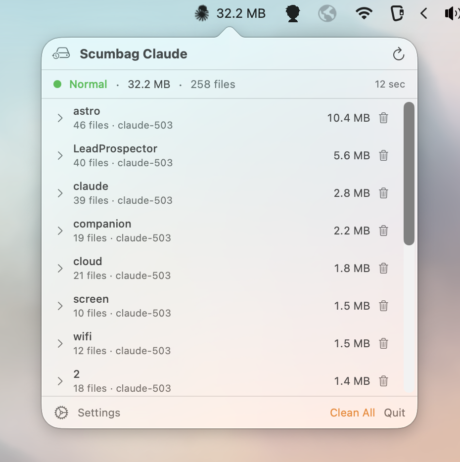
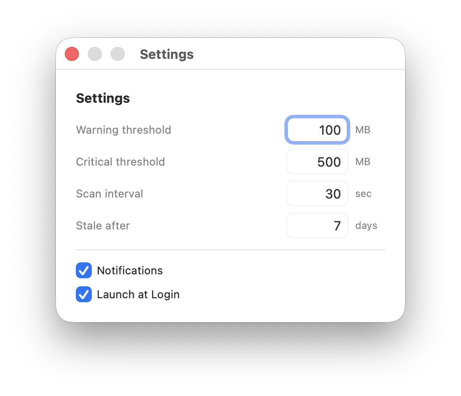

<p align="center">
  
</p>

<h1 align="center">Scumbag Claude</h1>

<p align="center">
  A macOS menubar app that monitors Claude Code's temporary files<br>
  before they eat your disk alive.
</p>

---

Claude Code writes task output to `/private/tmp/claude-*/` directories. These `.output` files (often symlinks to `.jsonl` files) can grow to hundreds of megabytes during long sessions and never clean themselves up. Scumbag Claude sits in your menubar, watches these directories, and lets you know when things get out of hand.

## Features

- **Menubar status indicator** -- icon changes color (green/orange/red) based on disk usage severity, with optional total size display
- **FSEvents monitoring** -- near-instant detection (~2.5s) of file changes via macOS filesystem events, with timer-based polling as a safety net
- **Per-project breakdown** -- groups files by Claude Code project, with expandable details showing individual file sizes
- **Growth rate tracking** -- shows per-file and per-project growth rates (e.g. "↑ 2.3 MB/min") for actively growing files
- **Symlink awareness** -- resolves symlinks to get actual sizes; "link only" badge for out-of-scope targets, "×N" badge for deduplicated files, broken symlink detection
- **System notifications** -- alerts when files cross warning or critical size thresholds (fires once per file per threshold, not repeatedly)
- **Search & sort** -- filter projects by name and sort by size, name, or modification date
- **One-click cleanup** -- delete individual files, entire projects, batch-delete selected files, clean all, or clean broken symlinks with inline confirmation
- **Stale directory detection** -- flags project directories that haven't been modified in a configurable number of days
- **File timestamps** -- compact relative modification times ("2m", "3h", "2d") on file rows and project subtitles
- **Statistics & history** -- track total size over time with area/line and stacked bar charts (1h/24h/7d/30d ranges), per-project color-coded breakdown with hover tooltips, current/peak/average summary stats, and configurable retention (1–30 days)
- **File write watchdog** -- Claude Code PreToolUse hook that blocks Write/Edit/Bash operations targeting files outside user-whitelisted directories, plus a configurable blocked commands list (e.g., `sudo`, `passwd`, `shutdown`) that rejects inherently dangerous commands regardless of directory, with macOS notifications for blocked attempts
- **Disk pressure detection** -- monitors available system disk space via APFS-aware API, shows an orange "Low Disk Space" banner when free space drops below a configurable threshold (default 10 GB)
- **Auto-update via Sparkle** -- automatic update checking with EdDSA signature verification and native macOS update UI, powered by the [Sparkle](https://sparkle-project.org/) framework
- **Configurable thresholds** -- set your own warning/critical size limits, scan interval, and stale directory age
- **Settings & About dialogs** -- dedicated settings window and right-click context menu with About dialog
- **Launch at login** -- optional auto-start via macOS `ServiceManagement`
- **Menubar-only** -- no Dock icon, no windows cluttering your workspace

## Screenshots

<p align="center">
  
  &nbsp;&nbsp;
  
</p>

## Why

Claude Code's Task tool writes `.output` files to `/private/tmp/claude-*/` that **never get cleaned up**. A single research-heavy session can generate hundreds of gigabytes, filling your disk without warning. This has been [reported as a bug](https://github.com/anthropics/claude-code/issues/26911) — one user hit **537 GB from a single session**, with disk-full emergencies 6+ times in 30 days. Until there's an official fix, Scumbag Claude watches these directories so you don't have to.

## Requirements

- macOS 13 (Ventura) or later
- Xcode 15+ or Swift 5.9+ toolchain

## Build & Install

### Quick start

```bash
git clone https://github.com/underactive/scumbag-claude.git
cd scumbag-claude
make install
```

This builds a release binary, packages it into `Scumbag Claude.app`, and copies it to `/Applications`.

### All build targets

| Command | What it does |
|---------|-------------|
| `swift build` | Debug build |
| `make build` | Release build |
| `make bundle` | Release build + `.app` bundle at `.build/release/Scumbag Claude.app` |
| `make sign` | Bundle + code sign with Developer ID certificate (auto-detected) |
| `make install` | Sign + copy to `/Applications` |
| `make run` | Release build and run directly |
| `make clean` | Remove build artifacts |

### Running without the app bundle

You can run the executable directly with `swift run` or `make run`, but the Dock icon will appear since `Info.plist` (which sets `LSUIElement`) isn't loaded outside the `.app` bundle. A programmatic fallback handles this, but the bundle is the intended way to run it.

## Configuration

All settings are accessible from the menubar dropdown. Defaults:

| Setting | Default | Description |
|---------|---------|-------------|
| Warning threshold | 100 MB | File/total size that triggers orange status |
| Critical threshold | 500 MB | File/total size that triggers red status |
| Scan interval | 15 seconds | How often the fallback timer polls (FSEvents handles most detection) |
| Stale threshold | 7 days | Days before a project directory is considered stale |
| Notifications | Enabled | System notification alerts on threshold crossings |
| Show size in menu bar | Enabled | Display total disk usage next to the menubar icon |
| History retention | 7 days | How long historical scan data is kept (1–30 days) |
| Disk pressure warnings | Enabled | Alert when available disk space drops below threshold |
| Disk pressure threshold | 10 GB | Free space level that triggers the low disk space banner |
| File write watchdog | Disabled | Block Claude Code from writing outside allowed directories |
| Launch at login | Disabled | Start automatically when you log in |

## How it works

Scumbag Claude uses macOS FSEvents to watch `/private/tmp` and `~/.claude/projects/` for filesystem changes, triggering a scan within ~2.5s of any change. A fallback timer polls every 15 seconds as a safety net. Each scan enumerates all subdirectories and files under `/private/tmp/claude-{uid}/`, resolves symlinks to get actual file sizes, deduplicates by resolved path, and groups everything by project. Growth rates are computed by comparing file sizes across successive scans. When a file crosses a size threshold, a system notification fires (once per file per threshold). The menubar icon updates to reflect the worst current status across all monitored files.

## License

MIT
